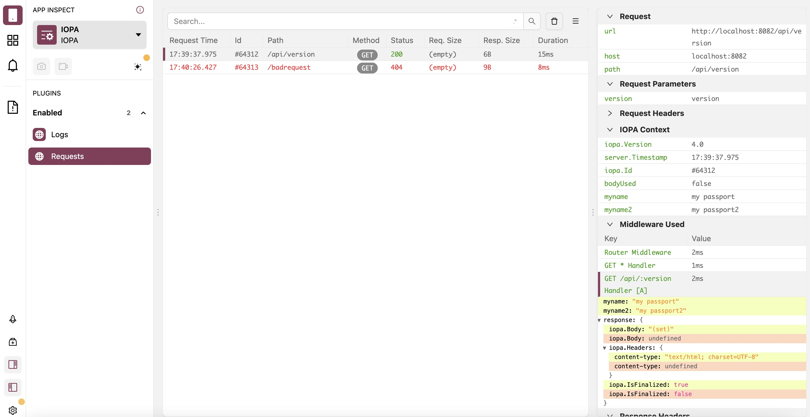

# <br> @iopa/flipper Mono Repository

[](https://iopa.io/)

## About

This repository contains:
 * Build scripts to create a stand-alone Flipper server as NodeJS process, that uses flipper-server-core for device communication and also provides a webserver to serve flipper-ui.
 * Plugins for Flipper that display information from IOPA applications (`Logging` and `Requests`)

## Screenshot



## Running flipper server

### From command line

```bash
npx @iopa/flipper
```

### From a NodeJS script

``` ts
if (process.env.NODE_ENV !== 'production') {
  const require: NodeRequire = createRequire(import.meta.url)
  const flipper: string = require.resolve('@iopa/flipper')
  fork(flipper, { stdio: 'inherit' })
}
```

## Build from Source

``` bash
git clone https://github.com/iopa-io/flipper.git iopa-flipper
cd iopa-flipper
yarn
yarn download
yarn build
```

## Publish from Source

``` bash
git clone https://github.com/iopa-io/flipper.git iopa-flipper
cd iopa-flipper
yarn
yarn download
yarn build
cd dist
npm publish
```


## Run from Source in Devleopment

``` bash
git clone https://github.com/iopa-io/flipper.git iopa-flipper
cd iopa-flipper
yarn
yarn download
yarn dev
```

## Prior Art

This repository is patched from the `facebook/flipper` by Meta.   Most of the core Flipper logic is unchanged and rebuilt from source each time.

## License

MIT


