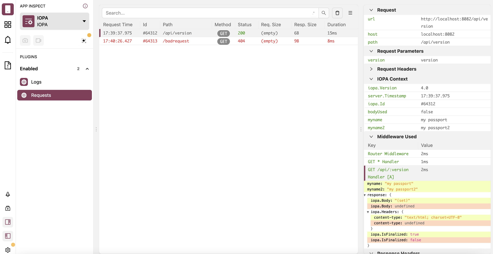

# <br> @iopa/flipper

[](https://iopa.io/)

## About

Stand alone Flipper server as NodeJS process, that uses flipper-server-core for device communication and also provides a webserver to serve flipper-ui.

This fork includes the two base IOPA plugins by default (`Logging` and `Requests`)

@iopa/flipper can be used as background process, for example on IOPA servers or to power IDE plugins.   

## Screenshot



## Running flipper server

### From command line

```bash
npx @iopa/flipper
```

### From a NodeJS script

``` ts
if (process.env.NODE_ENV !== 'production') {
  const require: NodeRequire = createRequire(import.meta.url)
  const flipper: string = require.resolve('@iopa/flipper')
  fork(flipper, { stdio: 'inherit' })
}
```

## Prior Art

This repository is patched from the `flipper-server` repository.

## License

MIT


